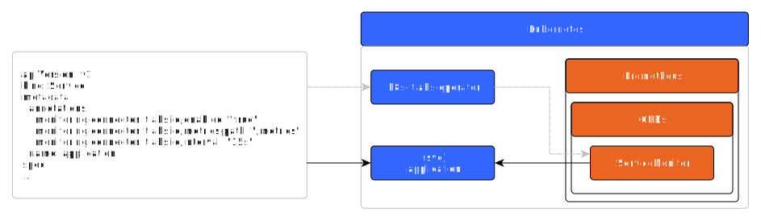
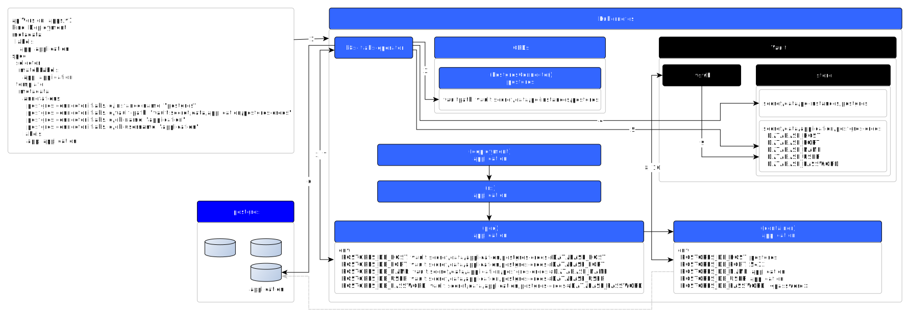
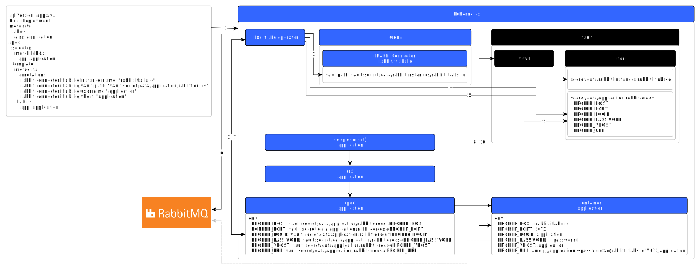
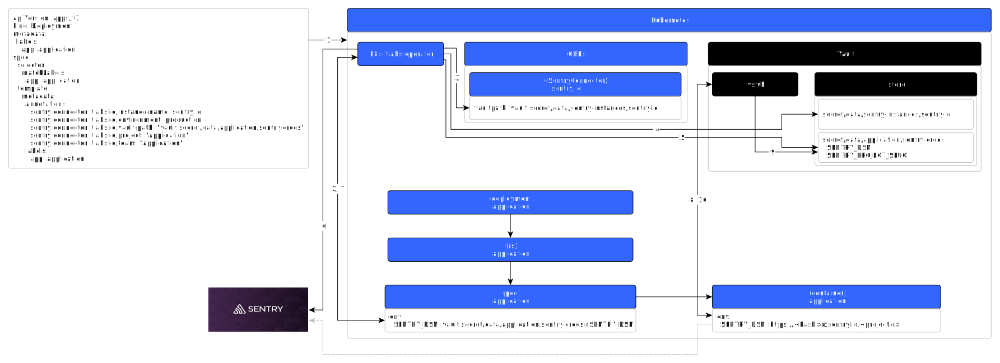

# K8S-ОПЕРАТОРЫ

---

Перечень доступных операторов:
* [keycloak](#keycloak).
* [monitoring](#monitoring);
* [postgres](#postgres);
* [rabbit](#rabbit);
* [sentry](#sentry);

Дополнительные требования:
* Наличие зависимостей, непосредственно принимающих участие в работе операторов:
   - Keycloak;
   - Postgres;
   - RabbitMQ;
   - Sentry;
   - Prometheus.
* Наличие второстепенных зависимостей:
   - Vault;
   - Vault Mutation Webhook (vswh).

[Пример развертывания](#пример)

## Keycloak

Добавляет переменные ***KEYCLOAK_CLIENT_ID***, ***KEYCLOAK_SECRET_KEY*** в контейнеры,
а так же создает клиента в Keycloak. В случае, если приложение развертывается в первый
раз, то так же будет создан секрет в Vault.

```yaml
apiVersion: apps/v1
kind: Deployment
metadata:
  labels:
    app: application
  name: application
spec:
  selector:
    matchLabels:
      app: application
  template:
    metadata:
      annotations:
        keycloak.connector.itlabs.io/instance-name: "keycloak"
        keycloak.connector.itlabs.io/vault-path: "vault:secret/data/application/keycloak-client-credentials"
        keycloak.connector.itlabs.io/client-id: "application"
      labels:
        app: application
```

* spec.template.metadata.labels.app - название приложения.
* spec.template.metadata.annotations.keycloak.connector.itlabs.io/instance-name - имя экземпляра Keycloak.
* spec.template.metadata.annotations.keycloak.connector.itlabs.io/vault-path - путь до секрета в Vault, где
должны быть сохранены настройки клиента Keycloak.
* spec.template.metadata.annotations.keycloak.connector.itlabs.io/client-id - название/идентификатор
клиента Keycloak.

### KeycloakConnector

_KeycloakConnector_ содержит настройки подключения для доступа к Keycloak, которые используются
оператором для создания Keycloak клиента. Данные настройки хранятся на стороне кластера. Все поля в `spec`
могут содержать как сразу значения, так и путь с точностью до ключа в секрете из волт-хранилища. Манифест
KeycloakConnector выглядит следующим образом:

```yaml
apiVersion: itlabs.io/v1
kind: KeycloakConnector
metadata:
  name: keycloak.io
spec:
  # Адрес по которому доступен Keycloak
  url: "https://keycloak.io:8080"
  # Название пространства в Keycloak
  realm: "application"
  # Учетная запись, относящаяся к заданному пространству (realm)
  username: vault:secret/data/keycloak-credentials#USERNAME
  password: vault:secret/data/keycloak-credentials#PASSWORD
```

Для просмотра перечня доступных экземпляров необходимо выполнить следующую команду:

```shell
kubectl get keycloakconnectors.itlabs.io
```

## Monitoring

Необходим для подключения сбора метрик приложения. Для того, чтобы оператор настроил сбор метрик,
необходимо в манифест ***сервиса*** добавить следующие аннотации:

```yaml
annotations:
  monitoring.connector.itlabs.io/enabled: "true"
  monitoring.connector.itlabs.io/metrics-path: "/metrics"
  monitoring.connector.itlabs.io/interval: "15s"
```

***monitoring.connector.itlabs.io/metrics-path*** содержит путь до конечной точки приложения,
по которой можно извлечь метрики (например: https://application.itlabs.io/metrics).

Пример сервиса с добавленными аннотациями:

```yaml
---
apiVersion: v1
kind: Service
metadata:
  annotations:
    monitoring.connector.itlabs.io/enabled: "true"
    monitoring.connector.itlabs.io/metrics-path: "/metrics"
    monitoring.connector.itlabs.io/interval: "15s"
  name: application
  namespace: default
spec:
  selector:
    app.kubernetes.io/name: application
  ports:
  - protocol: TCP
    port: 80
    targetPort: 80
```

В результате оператор создаст следующий объект:

```yaml
apiVersion: monitoring.coreos.com/v1
kind: ServiceMonitor
metadata:
  name: application
  namespace: default
  labels:
    app: http
spec:
  jobLabel: app
  selector:
    matchLabels:
      app: application
      app.itlabs.io/monitoring: enabled
  namespaceSelector:
    matchNames:
      - namespace
  endpoints:
    - port: http
      path: /metrics
      interval: 15s
```

### Схема работы



## Postgres

Добавляет переменные окружения для подключения к базе данных приложения, а также создает базу данных и сохраняет
секреты в _Vault_, в случае если приложение развертывается в первый раз.

```yaml
apiVersion: apps/v1
kind: Deployment
metadata:
  labels:
    app: application
spec:
  selector:
    matchLabels:
      app: application
  template:
    metadata:
      annotations:
        postgres.connector.itlabs.io/instance-name: "postgres"
        postgres.connector.itlabs.io/vault-path: "vault:secret/data/application/postgres-credentials"
        postgres.connector.itlabs.io/db-name: "application"      # (optional)
        postgres.connector.itlabs.io/db-username: "application"  # (optional)
      labels:
        app: application
```

* ***spec.template.metadata.labels.app*** - название приложения.
* ***spec.template.metadata.annotations.postgres.connector.itlabs.io/instance-name*** -
имя экземпляра _Postgres_.
* ***spec.template.metadata.annotations.postgres.connector.itlabs.io/vault-path*** - путь до
секрета в _Vault_, где должны быть сохранены настройки подключения до базы данных приложения
в _Postgres_.
* ***spec.template.metadata.annotations.postgres.connector.itlabs.io/db-name*** (опционально) -
название базы данных.
* ***spec.template.metadata.annotations.postgres.connector.itlabs.io/db-username*** (опционально) -
имя пользователя.

***Примечание:*** при отсутствии аннотаций ***postgres.connector.itlabs.io/db-name***,
***postgres.connector.itlabs.io/db-username*** в качестве значения по умолчанию будет использована
метка ***app***.

### PostgresConnector

_PostgresConnector_ содержит настройки подключения для привилегированного доступа к _Postgres_,
которые используются оператором для создания учетной записи и базы данных развертываемого приложения
(см. _"Схема работы": шаг 3_). Все поля в `spec` могут содержать как сразу значения, так и путь с
точностью до ключа в секрете из волт-хранилища. Данные настройки хранятся на стороне кластера.
Манифест _PostgresConnector_ выглядит следующим образом:

```yaml
apiVersion: itlabs.io/v1
kind: PostgresConnector
metadata:
  name: postgres.io
spec:
  # Хост для подключения к Postgres
  host: postgres.default
  # Порт для подключения к Postgres. Поле не является обязательным и в случае
  # его отсутствия по умолчанию будет установлен порт 5432.
  port: 5432
  # Имя системной базы данных. Поле не является обязательным и в случае
  # его отсутствия по умолчанию будет установлена база 'postgres'
  database: postgres
  # Путь к ключу секрета с именем привилегированной учетной записи
  username: vault:secret/data/infrastructure/postgres#USERNAME
  # Путь к ключу секрета с паролем привилегированной учетной записи
  password: vault:secret/data/infrastructure/postgres#PASSWORD
```

Для просмотра списка доступных настроек необходимо выполнить команду:

```bash
kubectl get postgresconnectors.itlabs.io
```

### Схема работы



1. Применяется манифест приложения.
2. При создании ***Pod*** срабатывает хук и управление передается _k8s-itlabs-operator_. Оператор
проверяет наличие необходимых меток и аннотаций, при отсутствии которых дальнейшая работа будет прекращена.
3. Оператор на основании значения, взятого из аннотации ***postgres.connector.itlabs.io/instance-name***,
ищет _PostgresConnector_ (_CustomResource_), чтобы получить путь до секрета в _Vault_, где хранятся
расширенные настройки доступа к _Postgres_, для создания пользователя и базы данных.
4. _k8s-itlabs-operator_ читает секрет в _Vault_, полученный из _PostgresConnector_.
5. Чтение секрета в _Vault_ с настройками подключения к базе данных приложения, путь до которого
взят из аннотации ***postgres.connector.itlabs.io/vault-path***. В случае, если секрет не обнаружен,
то оператор создаст его, взяв значения из аннотаций ***postgres.connector.itlabs.io/db-name***,
***postgres.connector.itlabs.io/db-username*** (при отсутствии данных аннотаций в качестве значений
по умолчанию будет взято значение из метки ***app***).
6. Выполняется проверка подключения к базе данных, которая будет создана в случае её отсутствия.
7. В ***Pod*** добавляются переменные окружения, содержащие пути до секретов в _Vault_,
для подключения к базе данных приложения:
   * ***POSTGRES_DB_HOST***;
   * ***POSTGRES_DB_PORT***;
   * ***POSTGRES_DB_NAME***;
   * ***POSTGRES_DB_USER***;
   * ***POSTGRES_DB_PASSWORD***.
8. При создании контейнеров для ***Pod*** срабатывает хук и управление передается _Vault Secret
Webhook_ (_vswh_).
9. _vswh_ читает секреты на основании значений взятых из переменных окружения.
10. В переменных окружения пути до секретов в _Vault_ заменяются на значения взятые из секретов.

### Особенности

Когда приложение содержит более одного ***Deployment***, то лучше явно указывать следующие аннотации:

* ***spec.template.metadata.annotations.postgres.connector.itlabs.io/vault-path***;
* ***spec.template.metadata.annotations.postgres.connector.itlabs.io/db-name***;
* ***spec.template.metadata.annotations.postgres.connector.itlabs.io/db-username***.

Пример, приводящий к ошибке:

```yaml
---
apiVersion: apps/v1
kind: Deployment
metadata:
  labels:
    app: application
spec:
  selector:
    matchLabels:
      app: application
  template:
    metadata:
      annotations:
        postgres.connector.itlabs.io/instance-name: "postgres"
        postgres.connector.itlabs.io/vault-path: "vault:secret/data/application/postgres-credentials"
      labels:
        app: application
---
apiVersion: apps/v1
kind: Deployment
metadata:
  labels:
    app: application-worker
spec:
  selector:
    matchLabels:
      app: application-worker
  template:
    metadata:
      annotations:
        postgres.connector.itlabs.io/instance-name: "postgres"
        postgres.connector.itlabs.io/vault-path: "vault:secret/data/application/postgres-credentials"
      labels:
        app: application-worker
```

Значения, полученные оператором в результате обработки манифестов:

```text
# application
    vault-path="vault:secret/data/application/postgres-credentials"
    instance-name="postgres"
    db-name="application"      # взято из spec.template.metadata.labels.app
    db-username="application"  # взято из spec.template.metadata.labels.app

# application-worker
    vault-path="vault:secret/data/application/postgres-credentials"
    instance-name="postgres"
    db-name="application-worker"       # взято из spec.template.metadata.labels.app
    db-username="application-workder"  # взято из spec.template.metadata.labels.app
```

```text
# Секрет в vault (vault:secret/data/application/postgres-credentials)

DATABASE_NAME="application"
DATABASE_USER="application"
...
```

Оператор, не обнаружив аннотаций
***spec.template.metadata.annotations.postgres.connector.itlabs.io/db-name***
и ***spec.template.metadata.annotations.postgres.connector.itlabs.io/db-username***, возьмет
в качестве значений по умолчанию значение из метки ***spec.template.metadata.labels.app***,
после чего, взяв секрет из _Vault_, сравнит со значениями полученными из аннотаций, что приведет к
ошибке, так как имя пользователя и базы данных не будет совпадать со значениями из секрета.

## Rabbit

Добавляет переменные окружения для подключения к _Rabbit_, а также создает пользователя, _vhost_ и
сохраняет секреты в _Vault_, в случае если приложение развертывается в первый раз.

```yaml
apiVersion: apps/v1
kind: Deployment
metadata:
  labels:
    app: application
spec:
  selector:
    matchLabels:
      app: application
  template:
    metadata:
      annotations:
        rabbit.connector.itlabs.io/instance-name: "rabbit"
        rabbit.connector.itlabs.io/vault-path: "vault:secret/data/application/rabbit-credentials"
        rabbit.connector.itlabs.io/username: "application"  # (optional)
        rabbit.connector.itlabs.io/vhost: "application"     # (optional)
      labels:
        app: application
```

* ***spec.template.metadata.labels.app*** - название приложения.
* ***spec.template.metadata.annotations.rabbit.connector.itlabs.io/instance-name*** -
имя экземпляра _Rabbit_.
* ***spec.template.metadata.annotations.rabbit.connector.itlabs.io/vault-path*** - путь до
секрета в _Vault_, где должны храниться настройки подключения приложения к _Rabbit_.
* ***spec.template.metadata.annotations.rabbit.connector.itlabs.io/username*** (опционально) -
имя пользователя.
* ***spec.template.metadata.annotations.rabbit.connector.itlabs.io/vhost*** (опционально) -
имя виртуального хоста _Rabbit_.

***Примечание:*** при отсутствии аннотаций ***rabbit.connector.itlabs.io/username***,
***rabbit.connector.itlabs.io/vhost*** в качестве значения по умолчанию будет использована
метка ***app***.

### RabbitConnector

_RabbitConnector_ хранит настройки подключения для привилегированного доступа к _Rabbit_,
которые использует оператор для создания vhost, пользователя, а так же настроек доступа
(см. _"Схема работы": шаг 3_). Все поля в `spec` могут содержать как сразу значения, так и путь с
точностью до ключа в секрете из волт-хранилища. Настройки хранятся на стороне кластера. Манифест _RabbitConnector_
выглядит следующим образом:

```yaml
apiVersion: itlabs.io/v1
kind: RabbitConnector
metadata:
  name: rabbit.io
spec:
  # Хост по которому доступен Rabbit
  brokerHost: rabbit.default
  # Порт по которому доступен Rabbit. Поле не является обязательным и в случае
  # его отсутствия по умолчанию будет установлен порт 5672
  brokerPort: 5672
  # Путь до административной панели управления
  url: https://rabbit.local
  # Путь к ключу секрета с именем привилегированной учетной записи
  username: vault:secret/data/infrastructure/rabbit#USERNAME
  # Путь к ключу секрета с паролем привилегированной учетной записи
  password: vault:secret/data/infrastructure/rabbit#PASSWORD

```

Для просмотра перечня доступных настроек необходимо выполнить команду:

```bash
kubectl get rabbitconnectors.itlabs.io
```

### Схема работы



1. Применяется манифест приложения.
2. При создании ***Pod*** срабатывает хук и управление передается _k8s-itlabs-operator_. Оператор
проверяет наличие необходимых меток и аннотаций, при отсутствии которых дальнейшая работа будет
прекращена.
3. Оператор выполняет поиск _RabbitConnector_ (_CustomResource_) по имени, взятого из значения
аннотации ***rabbit.connector.itlabs.io/instance-name***, чтобы получить путь до секрета в
_Vault_, где хранятся расширенные настройки доступа к _Rabbit_.
4. Оператор получает содержимое секрета _Vault_, путь до которого получен из _RabbitConnector_.
5. По значению, взятого из аннотации ***rabbit.connector.itlabs.io/vault-path***, оператор получает
содержимое секрета _Vault_ для получения настроек подключения к _Rabbit_ приложением.
6. Выполняется проверка подключения к заданному _vhost_ в _Rabbit_, который будет создан в случае
его отсутствия.
7. В ***Pod*** добавляются переменные окружения, содержащие пути до секретов в _Vault_ для
подключения к _Rabbit_:
   * ***BROKER_HOST***;
   * ***BROKER_PORT***;
   * ***BROKER_LOGIN***;
   * ***BROKER_PASSWORD***;
   * ***BROKER_VHOST***;
   * ***BROKER_URL***.
8. При создании контейнеров для ***Pod*** срабатывает хук, и управление передается _Vault Secret
Webhook_ (_vswh_).
9. _vswh_ читает секреты на основании значений, взятых из переменных окружения.
10. В переменных окружения пути до секретов в _Vault_ заменяются на значения из секретов.

### Особенности

В случае если приложение содержит более одного ***Deployment***, то лучше явно указывать
следующие аннотации:

* ***spec.template.metadata.annotations.rabbit.connector.itlabs.io/vault-path***;
* ***spec.template.metadata.annotations.rabbit.connector.itlabs.io/username***;
* ***spec.template.metadata.annotations.rabbit.connector.itlabs.io/vhost***.

Причины точно такие же, как и у Postgres (см. раздел _Postgres > Особенности_).

## Sentry

Позволяет добавить переменные окружения для подключения к _Sentry_. В случае если приложение
развертывается первый раз, то оператор так же создаст проект и dsn-ключ, который будет сохранен
в _Vault_ по указанному пути в аннотациях. Для подключения оператора в манифесте необходимо указать
следующие параметры в ***Deployment***:

```yaml
apiVersion: apps/v1
kind: Deployment
metadata:
  labels:
    app: application
spec:
  selector:
    matchLabels:
      app: application
  template:
    metadata:
      annotations:
        sentry.connector.itlabs.io/instance-name: sentry.io
        sentry.connector.itlabs.io/environment: "production"
        sentry.connector.itlabs.io/vault-path: "vault:secret/data/application/sentry-credentials"
        sentry.connector.itlabs.io/project: "application"   # (optional)
        sentry.connector.itlabs.io/team: "application"      # (optional)
      labels:
        app: application
```

* ***spec.template.metadata.labels.app*** - название приложения.

* ***spec.template.metadata.annotations.sentry.connector.itlabs.io/instance-name*** -
адрес, по которому доступен _Sentry_ (например, https://sentry.io).

* ***spec.template.metadata.annotations.sentry.connector.itlabs.io/environment*** - среда окружения,
где будет развернуто приложение. Название среды окружения будет использовано в качестве имени dsn-ключа.

    **Важно!** название окружения должно быть указано полным (_development_, _stage_, _production_).
    В _Sentry_ имя dsn-ключа будет иметь сокращенное название (обратная совместимость с ранее созданными
    dsn-ключами).

* ***spec.template.metadata.annotations.sentry.connector.itlabs.io/vault-path*** -
путь до секрета в _Vault_, где должны быть сохранены настройки подключения приложения к _Sentry_.

* ***spec.template.metadata.annotations.sentry.connector.itlabs.io/project*** (опционально) -
название проекта в _Sentry_.

* ***spec.template.metadata.annotations.sentry.connector.itlabs.io/team*** (опционально) -
название команды в _Sentry_.

***Примечание:*** в случае отсутствия аннотаций ***sentry.connector.itlabs.io/project***,
***sentry.connector.itlabs.io/team*** в качестве значения по умолчанию будет использована
метка ***app***.

### SentryConnector

_SentryConnector_ хранит настройки подключения для привилегированного доступа к _Sentry_,
которые использует оператор с целью проверки, создания команды и проекта развертываемого
приложения (см. _"Схема работы": шаг 3_). Все поля в `spec` могут содержать как сразу значения, так и путь с
точностью до ключа в секрете из волт-хранилища. Данные настройки хранятся на стороне кластера.
Манифест добавления _SentryConnector_ выглядит следующим образом:

```yaml
apiVersion: itlabs.io/v1
kind: SentryConnector
metadata:
  # В качестве имени добавляемой записи можно
  # использовать адрес по которому доступен Sentry.
  name: sentry.io
spec:
  # Адрес по которому доступен Sentry
  url: https://sentry.local
  # Название организации в Sentry. Поле не является обязательным и в случае
  # его отсутствия по умолчанию будет установлена организация 'sentry'
  organization: sentry
  # Токен доступа к API Sentry (см.: https://docs.sentry.io/api/auth/)
  token: vault:secret/data/infrastructure/sentry#API_TOKEN

```

Для просмотра списка доступных настроек необходимо выполнить следующую команду:

```bash
kubectl get sentryconnectors.itlabs.io
```

### Схема работы



1. Применяется манифест приложения.
2. При создании ***Pod*** срабатывает хук, и управление передается _k8s-itlabs-operator_. При
развертывании приложения оператор проверяет наличие обязательных меток и аннотаций. В случае
если не будет хватать нужных значений, то оператор не сработает.
3. Оператор на основании значения, взятого из аннотации ***sentry.connector.itlabs.io/instance-name***,
выполняет поиск _SentryConnector_ (_CustomResource_), чтобы получить путь до секрета в _Vault_, где
хранятся расширенные настройки доступа к _Sentry_.
4. Оператор получает содержимое секрета _Vault_, путь до которого получен из _SentryConnector_.
5. По значению, взятого из аннотации ***sentry.connector.itlabs.io/vault-path***, оператор получает
содержимое секрета _Vault_ для получения настроек подключения к _Sentry_ приложением.
6. Выполняется проверка наличия проекта и _dsn-ключа_ в _Sentry_, необходимых приложению для отправки
событий, при отсутствии которых оператор создаст их.
7. В ***Pod*** добавляется переменная окружения ***SENTRY_DSN***, содержащая путь до секрета в _Vault_
для подключения к _Sentry_.
8. При создании контейнеров для ***Pod*** срабатывает хук, и управление передается _Vault Secret
Webhook_ (_vswh_).
9. _vswh_ читает секрет на основании значения, взятого из переменной окружения.
10. В переменную окружения путь до секрета в _Vault_ заменяется на конкретное значение.

### Особенности

Если приложение содержит несколько ***Deployment***, то лучше явно указывать следующие
аннотации, чтобы исключить появление ошибки:

* ***spec.template.metadata.annotations.sentry.connector.itlabs.io/project***;
* ***spec.template.metadata.annotations.sentry.connector.itlabs.io/team***.

Причины точно такие же, как и у Postgres (см. раздел _Postgres > Особенности_).


## Пример

Рассмотрим пример развертывания приложения, которое включает сервер и фоновый обработчик, где для сервера
необходимы подключения к _Postgres_, _Rabbit_, _Sentry_, а для обработчика только _Postgres_ и _Sentry_.
Предполагается, что приложение будет доступно по адресу https://application.io, а так же с приложения
хотим получать метрики (например, чтобы посмотреть в Grafana), где метрики доступны по следующей ссылке
https://application.io/metrics.

```yaml
apiVersion: v1
kind: Service
metadata:
  annotations:
    # Аннотации для подключения сбора метрик.
    # (метрики будут собираться при помощи Prometheus).

    # Включить/отключить сбор метрик.
    monitoring.connector.itlabs.io/enabled: "true"
    # Конечная точка приложения по которой доступны метрики для сбора.
    monitoring.connector.itlabs.io/metrics-path: "/metrics"
    # С каким интервалом необходимо Prometheus собирать метрики.
    monitoring.connector.itlabs.io/interval: "15s"
  labels:
    app: application
  name: application
  namespace: default
spec:
  selector:
    app: application
  ports:
  - name: http
    port: 80
    protocol: TCP
    targetPort: http
---
apiVersion: apps/v1
kind: Deployment
metadata:
  name: application
  namespace: default
spec:
  replicas: 1
  selector:
    matchLabels:
      app: application
  strategy:
    rollingUpdate:
      maxSurge: 0
      maxUnavailable: 1
    type: RollingUpdate
  template:
    metadata:
      annotations:
        # Аннотации для подключения Keycloak.

        # Название экземпляра Keycloak
        # (перечень доступных экземпляров можно посмотреть при помощи команды: kubectl get keycloakconnectors.itlabs.io).
        keycloak.connector.itlabs.io/instance-name: "keycloak.io"
        # Путь к секрету в Vault, где должны храниться настройки клиента Keycloak. В случае отсутствия
        # секрета по заданному пути оператор создаст клиента и сохранит настройки подключения. Созданный
        # секрет будет содержать следующие ключи:
        #   - KEYCLOAK_CLIENT_ID
        #   - KEYCLOAK_SECRET_KEY
        keycloak.connector.itlabs.io/vault-path: "vault:secret/data/application/keycloak-client-credentials"
        # Название клиента в Keycloak.
        keycloak.connector.itlabs.io/client-id: "application"

        # Аннотации для подключения Postgres.

        # Имя сервера, где развернут Postgres.
        postgres.connector.itlabs.io/instance-name: "postgres"
        # Путь к секрету в Vault, где должны находиться настройки подключения к базе данных приложения.
        # В случае отсутсвия секрета по заданному пути оператор создаст базу данных, пользователя и
        # сохранит настройки. Созданный секрет будет содержать следующие ключи:
        #   - DATABASE_HOST;
        #   - DATABASE_PORT;
        #   - DATABASE_NAME;
        #   - DATABASE_USER;
        #   - DATABASE_PASSWORD.
        postgres.connector.itlabs.io/vault-path: "vault:secret/data/application/postgres-credentials"
        # Имя базы данных приложения. В случае отсутствия данной аннотации оператор возьмет метку `app`
        # в качестве значения по умолчанию.
        postgres.connector.itlabs.io/db-name: "application"
        # Имя пользователя базы данных. В случае отсутствия данной аннотации оператор возьмет метку `app`
        # в качестве значения по умолчанию.
        postgres.connector.itlabs.io/db-username: "application"

        # Аннотации для подключения Rabbit.

        # Имя сервера, где развернут Rabbit
        rabbit.connector.itlabs.io/instance-name: "rabbit"
        # Путь к секрету в Vault, где должны находиться настройки подключения к Rabbit.
        # В случае отсутствия секрета оператор создаст настройки подключения и сохранит
        # их по заданному пути. Созданный секрет будет содержать следующие ключи:
        #   - BROKER_HOST;
        #   - BROKER_PORT;
        #   - BROKER_LOGIN;
        #   - BROKER_PASSWORD;
        #   - BROKER_VHOST;
        #   - BROKER_URL.
        rabbit.connector.itlabs.io/vault-path: "vault:secret/data/application/rabbit-credentials"
        # Имя пользователя для подключения к Rabbit.
        rabbit.connector.itlabs.io/username: "application"
        # Имя виртуального хоста в Rabbit.
        rabbit.connector.itlabs.io/vhost: "application"

        # Аннотации для подключения Sentry.

        # Адрес по которому доступен Sentry.
        sentry.connector.itlabs.io/instance-name: "sentry.io"
        # Название среды окружения используемое для создания dsn-ключа. Доступные значения:
        #   - development;
        #   - stage;
        #   - production.
        sentry.connector.itlabs.io/environment: "production"
        # Имя проекта в Sentry.
        sentry.connector.itlabs.io/project: "application"
        # Название команды в Sentry за которым должен быть закреплен проект.
        sentry.connector.itlabs.io/team: "application"
        # Путь к секрету в Vault, где должны находиться настройки подключения к Sentry.
        # В случае отсутствия секрета оператор проверит, и при необходимости создаст в
        # Sentry команду и проект, а после чего сохранит их по заданному пути. Созданный
        # секрет будет содержать следующие ключи:
        #   - SENTRY_DSN;
        #   - SENTRY_PROJECT_SLUG.
        sentry.connector.itlabs.io/vault-path: "vault:secret/data/application/sentry-credentials"
        # Аннотации для подключения vswh (Vault Secret Webhook).
        # vswh заменяет в переменных окружения контейнера пути к Vault ключам, хранящихся
        # в секретах, на реальные значения. Ознакомиться с аннотациями можно по ссылке:
        #   https://banzaicloud.com/docs/bank-vaults/mutating-webhook/annotations/
        vault.security.banzaicloud.io/vault-addr: "https://vault.io"
        vault.security.banzaicloud.io/vault-path: "prod-kube"
        vault.security.banzaicloud.io/vault-role: "prod-default"
        vault.security.banzaicloud.io/vault-skip-verify: "true"
      labels:
        app: application
    spec:
      initContainers:
        - name: migrations
          image: application
          command:
            - /bin/sh
            - -c
            - python entrypoints/migrate.py
      containers:
        - name: server
          image: application
          command:
            - /bin/sh
            - -c
            - python entrypoints/server.py
---
apiVersion: apps/v1
kind: Deployment
metadata:
  name: application-worker
  namespace: default
spec:
  replicas: 1
  selector:
    matchLabels:
      app: application-worker
  strategy:
    rollingUpdate:
      maxSurge: 0
      maxUnavailable: 1
    type: RollingUpdate
  template:
    metadata:
      annotations:
        # Аннотации подключения Postgres.

        # Имя сервера, где развернут Postgres.
        postgres.connector.itlabs.io/instance-name: "postgres"
        # Путь к секрету в Vault, где должны находиться настройки подключения к базе данных приложения.
        # В случае отсутсвия секрета по заданному пути оператор создаст базу данных, пользователя и
        # сохранит настройки. Созданный секрет будет содержать следующие ключи:
        #   - DATABASE_HOST;
        #   - DATABASE_PORT;
        #   - DATABASE_NAME;
        #   - DATABASE_USER;
        #   - DATABASE_PASSWORD.
        postgres.connector.itlabs.io/vault-path: "vault:secret/data/application/postgres-credentials"
        # Имя базы данных приложения. В случае отсутствия данной аннотации оператор возьмет метку `app`
        # в качестве значения по умолчанию.
        postgres.connector.itlabs.io/db-name: "application"
        # Имя пользователя базы данных. В случае отсутствия данной аннотации оператор возьмет метку `app`
        # в качестве значения по умолчанию.
        postgres.connector.itlabs.io/db-username: "application"

        # Аннотации для подключения Sentry.

        # Адрес по которому доступен Sentry.
        sentry.connector.itlabs.io/instance-name: "sentry.io"
        # Название среды окружения используемое для создания dsn-ключа. Доступные значения:
        #   - development;
        #   - stage;
        #   - production.
        sentry.connector.itlabs.io/environment: "production"
        # Имя проекта в Sentry.
        sentry.connector.itlabs.io/project: "application"
        # Название команды в Sentry за которым должен быть закреплен проект.
        sentry.connector.itlabs.io/team: "application"
        # Путь к секрету в Vault, где должны находиться настройки подключения к Sentry.
        # В случае отсутствия секрета оператор проверит, и при необходимости создаст в
        # Sentry команду и проект, а после чего сохранит их по заданному пути. Созданный
        # секрет будет содержать следующие ключи:
        #   - SENTRY_DSN;
        #   - SENTRY_PROJECT_SLUG.
        sentry.connector.itlabs.io/vault-path: "vault:secret/data/application/sentry-credentials"

        # Аннотации для подключения vswh (Vault Secret Webhook).
        # vswh заменяет в переменных окружения контейнера пути к Vault ключам, хранящихся
        # в секретах, на реальные значения. Ознакомиться с аннотациями можно по ссылке:
        #   https://banzaicloud.com/docs/bank-vaults/mutating-webhook/annotations/
        vault.security.banzaicloud.io/vault-addr: "https://vault.io"
        vault.security.banzaicloud.io/vault-path: "prod-kube"
        vault.security.banzaicloud.io/vault-role: "prod-default"
        vault.security.banzaicloud.io/vault-skip-verify: "true"
      labels:
        app: application-worker
    spec:
      containers:
        - name: worker
          image: application
          command:
            - /bin/sh
            - -c
            - python entrypoints/worker.py
```
